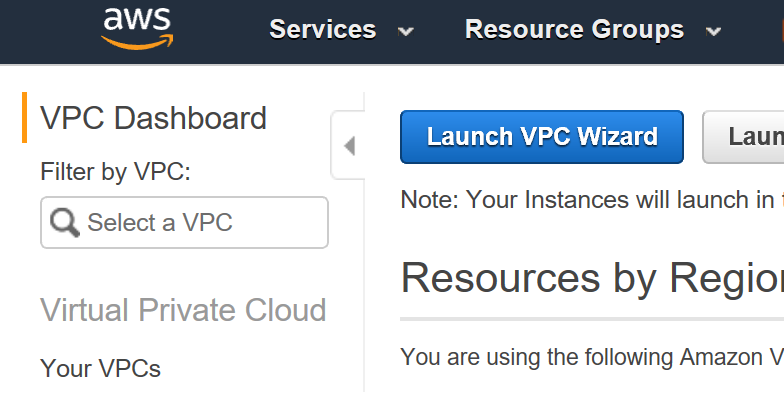
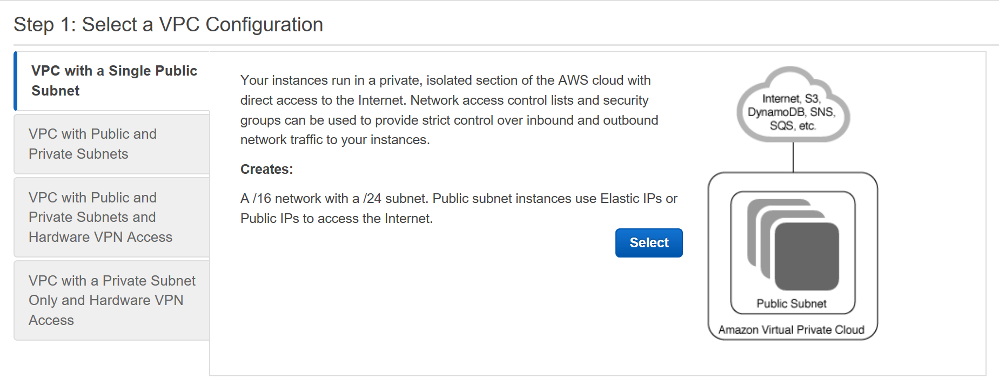
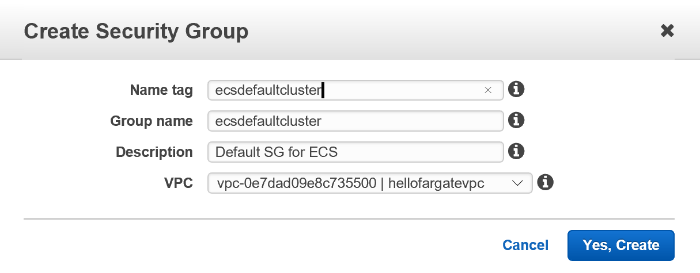
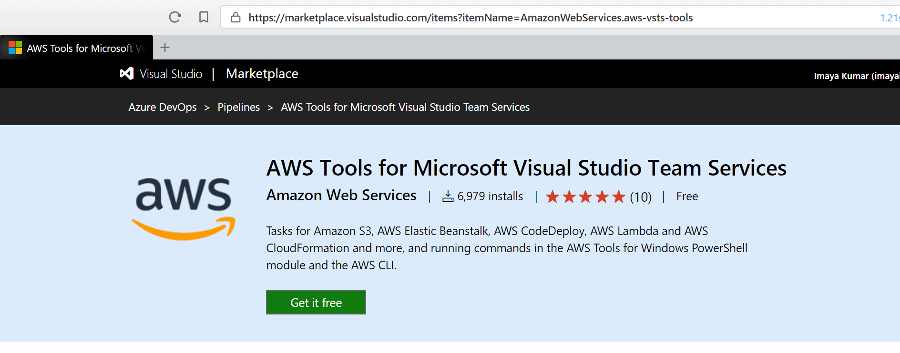
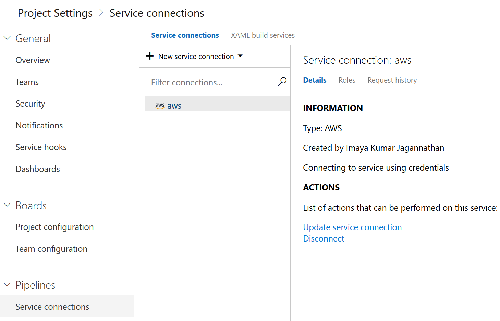
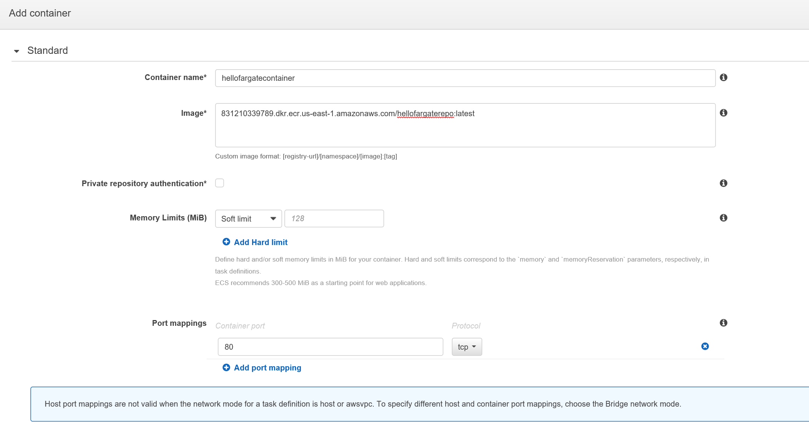
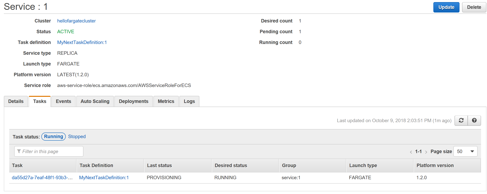
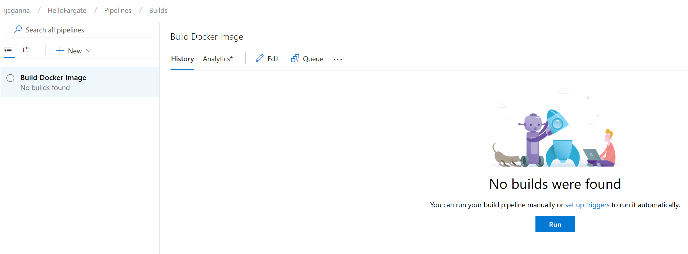
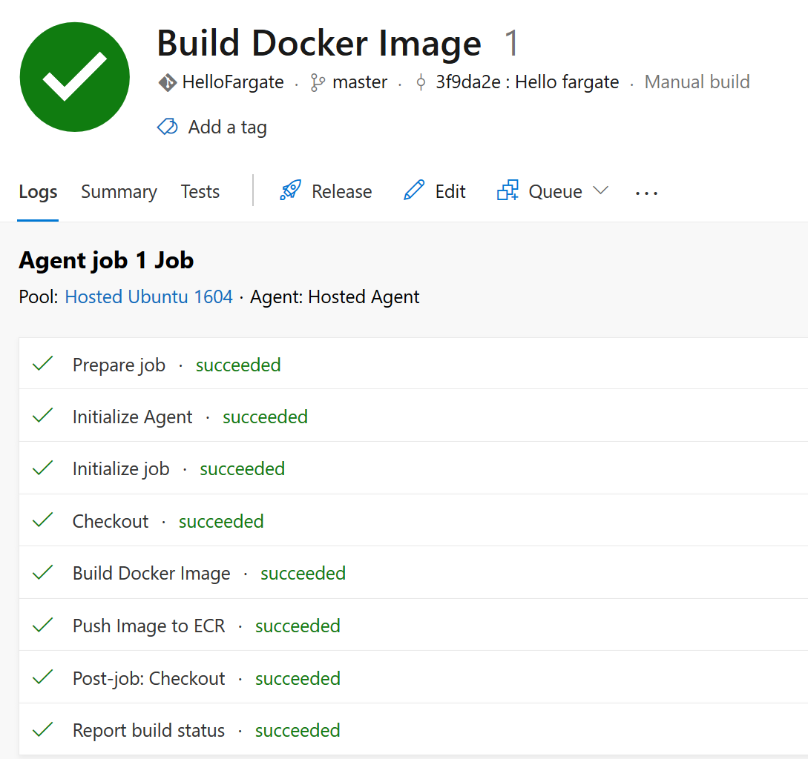
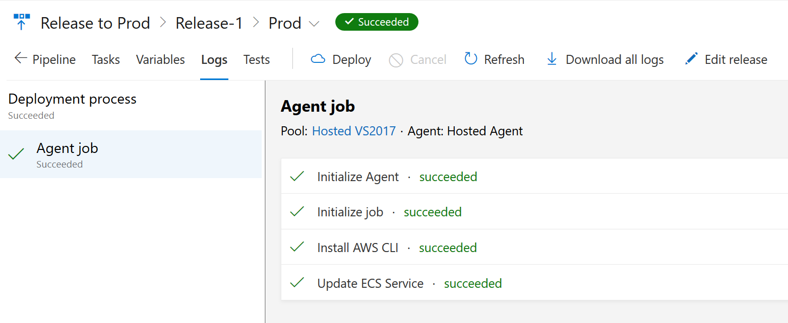

## Create VPC
* Login to AWS Console and navigate to the VPC home page
* Click on **Launch VPC Wizard** button

* Select **VPC with a Single Public Subnet** and click **Select**

* Leave the first 2 settings as is, and give the VPC name as _hellofargatevpc_
* Select an Availability Zone from the **Availability Zone** drop down
* Leave everything else as is and click **Create VPC**
* Your new VPC is created successfully

## Create Security Group
* Click on **Security Groups** under **Security** on the left hand side navigation section
* Click on **Create Security Group**
* In the pop-up screen, select _hellofargatevpc_ which we just created for the VPC drop down
* Type _Default SG for ECS_ for the **Description** text box
* Type _ecsdefaultcluster_ for the **Name tag** text box 
* See screen below for clarity

* Click **Create**
* Now go to the **Inbound Rules** tab on the security group you just created and add HTTP Port 80 to be allowed. Look at the screenshot below for clarity

* Click **Save**
* Your Security Group is created successfully

## Create a new Elastic Container Repository
* Login to AWS Console and navigate to Elastic Container Service home page
* Click **Repositories** under **Amazon ECR**
* Click **Create Repository**
* Enter _hellofargaterepo_ in the **Repository name** text field and click **Next step**
* Your new Elastic Container Repository is created successfully

# Setup Azure DevOps Environment
## Install AWS Tools for Azure DevOps

* Navigate to [Visual Studio Marketplace](https://marketplace.visualstudio.com/items?itemName=AmazonWebServices.aws-vsts-tools) and click on **Get it free** button as shown in the image below

## Configure AWS Account
* If you're logged in to Azure DevOps already, you will be taken to your Azure DevOps account where you can select the Organization as shown below.  
* Once you click, AWS Tools for VSTS will be installed on the organization successfully. You will screen like the below if the the process was successful. Click **Proceed to organization**

# Create Azure DevOps Pipeline
## Setup AWS Connection with Azure DevOps
* On your Azure DevOps home page, go ahead and create a project.
* Under Project Settings > Service connections, click on **New Service connections** and select **AWS** from that list
* You will see a window similar to the screenshot below. Give a connection name, enter the Access Key Id and Secret Access Key. Click **OK**
 
* You will see a screen like the one below once this process is complete

## Create a Build Pipeline
* Navigate to **Repos** page on the left navigation section. The screen should look similar to this below

* Push code from your local machine to this repo. _git pull_ the source code (HelloFargate.zip) from here - https://github.com/awsimaya/ECSFargate-CICD
* Click **Builds** under **Pipelines**. On this page, click **New Pipeline**
* Your page should look like the one below
 Click **Use the visual designer** link under **Where is your code?** section 
* In the next step, select the repo you want to connect to and click **Continue**
* On the **Select a template** screen, select **Empty Job** as shown in the screenshot below and click **Apply**

* Now you should be on the **Tasks** tab inside the Build pipeline. Here, to the right hand side for the drop down **Agent Pool** under **Agent job**, select _Hosted Ubuntu 1604_. Leave other fields to the default values.
* Add a task by click on the **+** sign next to **Agent job 1** on the left hand side. Type **Command** on the search bar on the right hand side. You should see the **Command Line** task as shown below
. Now click **Add**
* Once added, name the task **Build Docker Image** and enter the command _docker build -t hellofargate ./HelloFargate_ in the **Script** field as shown below

* Once again click on the + symbol next to  **Agent job 1**. Type _aws_ on the search field which will list all **AWS** tasks. 
* Select _AWS Elastic Container Registry Push_ task and click **Add**
* Name the image _Push Image to ECR_. Select the name of the AWS Credentials you setup earlier under **AWS Credentials** drop down. Select _US East (N.Virginia)_ as Region. Select _Image name with optional tag_ for Image identity field. Enter _hellofargate_ for the **Source Image Name** field. Enter _latest_ for **Source Image tag** field. Enter _hellofargaterepo_ for the **Target Repository Name** field. Enter _latest_ for the **Target Repository Tag** field. Now click on **Save pipeline** to save your changes. The screenshot below shows all the settings for easier understanding.

* You can rename the build pipeline by just clicking on **HelloFargate-CI** at the top and typing a name as shown below

* Go to the AWS ECR console and click on **hellofargaterepo** repository and make sure there is a new entry and the **Pushed at** column reflects the latest timestamp

## Create ECS Task Definition
* Login to AWS Console and navigate to Elastic Container Service home page
* Select **Task Definitions** and click on **Create new Task Definition** 
* On the next screen, select **FARGATE** launch type and click **Next**
* On the next screen, give the Task Definition a name. In this exercise, I will call it _MyNextTaskDefinition_
* Select _1 GB_ for Task memory and _0.5 vCPU_ for Task CPU dropdowns respectively
* Your screen should look similar to the one below

* Click **Add Container**
* Name the container as _hellofargatecontainer_
* Copy and paste the Repository URL from ECR and paste into **Image** textbox. Make sure you add the tag _:latest_ to the end of the string
* Add _80_ to Port mappings and click **Add**
* Your screen should look similar to the one below

* Now click **create**
* Your Task definition is created successfully

## Create ECS Cluster
* Click on **Clusters** on the ECS home page
* Click on **Create Cluster**
* Select **Networking Only** and click **Next step**
* Name the cluster as _hellofargatecluster_ and click **Create**
* ECS cluster is created sucessfully

## Create a new Service
* On the newly created cluster page, click on **Create** under **Services** tab
* Make sure the Task Definition and the Clusters are selected to the ones you just created
* Enter _1_ for Service name field
* Enter _1_ for Number of tasks field and leave everything else as is. Click **Next step**
* Select _hellofargatevpc_ for the Cluster VPC drop down
* Select the only subnets that appears in the drop down for the **Subnets** field
* Click on **Edit** for **Security groups** and select **Select existing security group** under **Assigned security group**
* Select the SG that has a description saying **Default SG for ECS** and click **Save**
* Make sure **Auto-assign public IP** is set to _ENABLED_
* Select _None_ for Load balancing
* Under **Service Discovery** uncheck the **Enable service discovery integration** checkbox and click **Next Step**
* Leave the **Set Auto Scaling** to _Do not adjust the service's desired count_ as it is
* Do a quick review of the **Review** screen and click **Create service**
* The cluster service is not created successfully
* Go to the **Tasks** tab and check the **Last status** column. It will refresh its status to **RUNNING** and turn green once the provisioning is complete
* The current screen should look similar to the one below. Notice that the **Last status** column says _PROVISIONING_ which means the taks is currently being executed

* Once the value on **Last status** column says **RUNNING** and is green, click on the task name under **Task** column
* On the next page under **Network**, click on the link next to **ENI Id**
* You will be taken to a page similar to the one below. Now copy paste the value under **IPV4 Public IP** column on a browser and press enter.

* You should see the home page of the your new application running on Amazon ECS Fargate

# Create a Release Pipeline
* Go to **Releases** page on your Azure DevOps project
* Click **New pipeline**
* Select **Empty job** under **Select a template**
* Enter _Prod_ for Stage name field
* Change the name of the pipeline to _Release to Prod_. 
* Now your screen should look similar to the below screenshot

* Hover your mouse over **1 job, 0 task** link and click on the + sign that becomes visible. This will allow you to add new tasks to the pipeline.
* In the next screen, under **Agent job**, select _Hosted 2017_ for **Agent pool** drop down
* Now click on the + sign next to **Agent job** and type _Command_ in the search field. Select the **Command Line** task and click **Add**
* Name the task _Install AWS CLI_ and enter _pip install awscli_ in the **Script** field
* Click on the + sign next to **Agent job**. Type **aws** in the search field. Select **AWS CLI** task and click **Add**
* Name the new task _Update ECS Service_. Select the name of the AWS credential you configured earlier.
* Select **US East (N.Virginia)** as region
* Enter _ecs_ in the **Command** field. 
* Enter _update-service_ in the **Subcommand** field. 
* Enter --service hellofargatecontainer-service --force-new-deployment in the **Options and parameters** field

* Save the changes.
## Run Build Pipeline
* Go to **Builds** and select the build pipeline you created earlier.
* You should see a screen similar to the one below. Click **Run**

* Simply click **Queue** in the pop-up screen
* The build is now queued and an agent will pick it up for processing. Once it gets picked up and gets executed successfully, you will see a screen like the one below

## Run Release Pipeline
* Go to **Releases** and select the release pipeline you created earlier.
* You should see a screen similar to the one below. Click **Create a release**

* Select _Prod_ in the drop down for **Stages for a trigger change from automated to manual** and click **Create**
* In the next screen, click on **Release-1** that appears on the green bar

* Your next screen will look similar to the one below. Hover the mouse arrow on **Prod** stage rectangle. Click on **Deploy** button.

* Simply click **Deploy** in the pop-up screen
* The job will be queued and will be picked up once an agent gets free. After its complete, your screen should look like the one below

## Final Steps
* Now you have a fully functional Build and Deploy pipeline setup for your application running on Amazon Elastic Cluster Service
* Go ahead and make some simple change to the project and do a git push to the repo.
* Queue a Build and a Release to see your changes reflecting successfully on your target environment